# CommuGround Case Tracker — Training Manual

A hands-on course for operators. Work through the modules in order — each one introduces a
concept, shows it (diagram + screenshot), then gives you a small exercise to try on the board.
By the end you can run a full shift: triage, pick, track, escalate, hand over, and report.

> This manual is about **using** the board. Setup, credentials and deployment live in
> [`SETUP.md`](SETUP.md). There is also a built-in interactive tour — **"Take the tour →"** at the
> bottom of the sidebar.

**Contents**

| Module | Topic |
| --- | --- |
| [0](#module-0--what-is-commuground) | What is CommuGround & how data flows |
| [1](#module-1--signing-in) | Signing in |
| [2](#module-2--the-screen) | The screen, zone by zone |
| [3](#module-3--the-two-status-model) | The two-status model (the core idea) |
| [4](#module-4--triage-and-picking) | Triage & picking cases |
| [5](#module-5--reading-the-route-board) | Reading the Hand-off Route Board |
| [6](#module-6--track-status-in-depth) | Track Status in depth + assigning Core members |
| [7](#module-7--handover) | Shift handover |
| [8](#module-8--exports) | Exporting tables for Teams / Excel |
| [9](#module-9--data-freshness-and-clocks) | Keeping data fresh & understanding the clocks |
| [10](#module-10--shifts-and-owners) | Shifts & Owners pages |
| [11](#module-11--troubleshooting) | Troubleshooting |
| [A](#appendix--sign-off-checklist) | Training sign-off checklist |

---

## Module 0 — What is CommuGround?

CommuGround replaces the shared Excel workbook. It tracks every support case and makes one thing
visible at a glance: **who is holding each case right now — the User, 1st Line, the Core Team, or
HQ — and where it should go next.**

You never edit cases *in* CommuGround's source system. Cases live in **Case Center**; CommuGround
mirrors them and adds a layer of **your** work on top (picks, intents, notes, reminders):

```
                 automatic sync                      you, in the browser
 ┌─────────────┐   (schedule +   ┌──────────┐   ┌─────────┐   ┌──────────────────┐
 │ Case Center │ ──── ⟳ ───────▶ │ Database │──▶│   API   │──▶│  CommuGround     │
 │  (source of │    ingest       │  (shared │   │ (login) │   │  board — YOU     │
 │   truth)    │                 │   store) │◀──│         │◀──│  work here       │
 └─────────────┘                 └──────────┘   └─────────┘   └──────────────────┘
        ▲                                                            │
        └────────────── you still resolve cases in Case Center ─────┘
```

Two consequences worth remembering:

1. **The board is shared.** Everyone signs into the same database — when you pick a case or write
   a note, your teammates see it.
2. **A data refresh can never destroy your work.** Sync only updates the fields Case Center owns
   (status, subject, assignee, timeline…). Your picks, Track Statuses, notes and reminders are a
   separate layer (more in [Module 9](#module-9--data-freshness-and-clocks)).

---

## Module 1 — Signing in

Two steps, both once per browser tab:

**Step 1 — the team access token.** This is a shared team secret (ask your lead), not a personal
password. It unlocks the API.

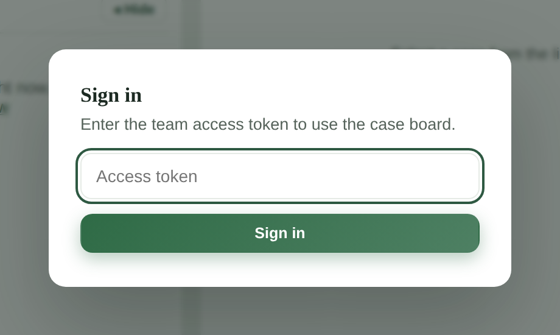

**Step 2 — "Who are you?"** Pick your own name. This is not cosmetic: every pick, handover note
and status change is recorded under the selected operator — in the case history, on the Route
Board tracker tags, and in exported reports.

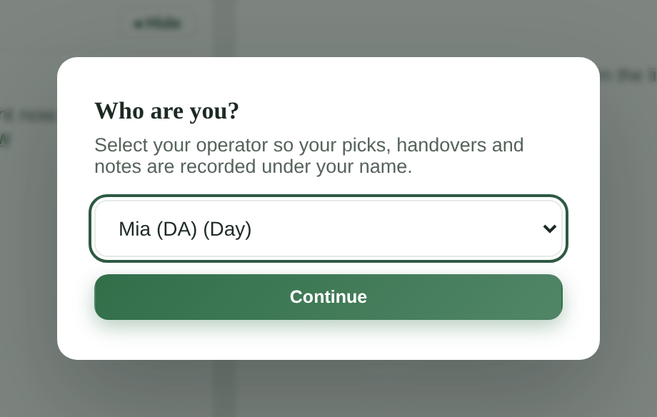

```
  token ──▶ who are you? ──▶ board
  (team     (YOUR name —      (everything you do is
   secret)   attribution!)     signed with that name)
```

- Your operator choice sticks **per device**; switch later with the **ON SHIFT** dropdown in the
  sidebar.
- **Sign out** (sidebar footer) clears the token for this tab.

> ⚠️ **Most common new-starter mistake:** working under someone else's name. Check the ON SHIFT
> box in the sidebar before you start acting on cases.

---

## Module 2 — The screen

Everything happens on one main screen, the **Picked** page. Learn these four zones:

```
┌────────────┬──────────────────────────────────────────────────────────┐
│  SIDEBAR   │  ①  PICKED WORKSPACE header    (+ Import case by ID)     │
│  Picked    │ ┌──────────────────────────────────────────────────────┐ │
│  Overview  │ │ ②  HAND-OFF ROUTE BOARD                              │ │
│  Shifts    │ │    one row per picked case: who holds it,            │ │
│  Owners    │ │    where it's going, and the deadline                │ │
│  Status    │ │            [Export to CSV] [Copy as table]           │ │
│  Flow      │ └──────────────────────────────────────────────────────┘ │
│  Clock     │ ┌───────────────┐ ┌────────────────────────────────────┐ │
│  model     │ │ ③ PICKED      │ │ ④ READING PANEL                    │ │
│            │ │   CASES list  │ │   clocks · timeline · routing ·    │ │
│  16:14:56  │ │   [Cases]     │ │   notes · history · ALL actions    │ │
│  MST/GMT+8 │ │   [Sanity]    │ │                                    │ │
│  ON SHIFT: │ │   tabs        │ │                                    │ │
│  Mia (Day) │ └───────────────┘ └────────────────────────────────────┘ │
└────────────┴──────────────────────────────────────────────────────────┘
```

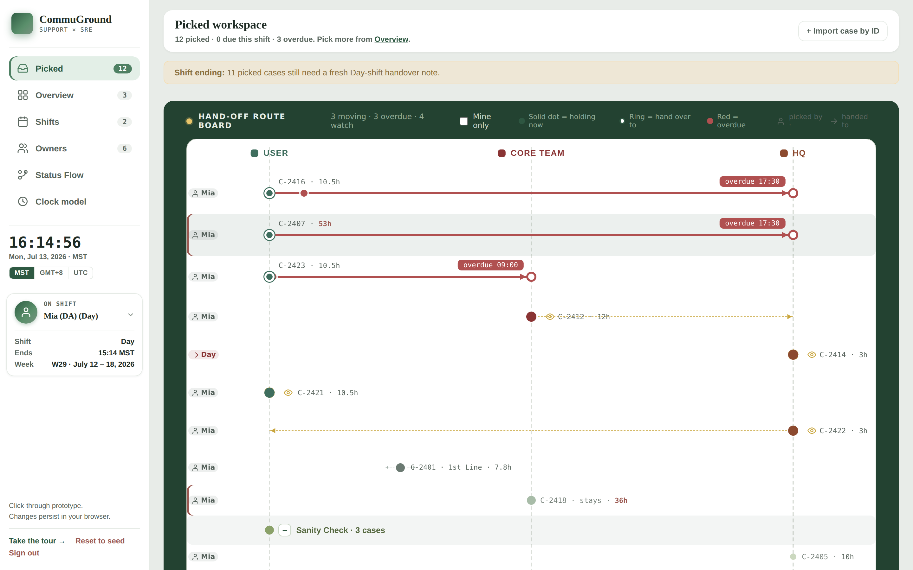

The sidebar also carries the **live clock with a timezone toggle** (MST / GMT+8 / UTC — every time
on the board follows it), your **shift and when it ends**, and the current **week**.

| Sidebar item | What it's for |
| --- | --- |
| **Picked** | Your working screen (the four zones above) |
| **Overview** | *All* cases by week — your triage inbox ([Module 4](#module-4--triage-and-picking)) |
| **Shifts** | Day/Night rosters, weekly rota, handover state ([Module 10](#module-10--shifts-and-owners)) |
| **Owners** | Core Team desks & HQ Product Teams directory ([Module 10](#module-10--shifts-and-owners)) |
| **Status Flow** | Reference — how Case Center statuses map to board columns |
| **Clock model** | Reference — precise definition of every timer |

**Try it:** open the board, find how long is left in your shift (sidebar → *Ends*), and flip the
timezone toggle — watch every timestamp on the page change.

---

## Module 3 — The two-status model

This is the single most important concept. **Every case carries two independent statuses:**

```
        ┌───────────────────────────────┐    ┌────────────────────────────────┐
        │  CASE CENTER STATUS (pill)    │    │  TRACK STATUS (your intent)    │
        ├───────────────────────────────┤    ├────────────────────────────────┤
        │ WHERE THE CASE REALLY IS      │    │ WHERE *YOU* SAY IT SHOULD GO   │
        │                               │    │                                │
        │ set by:   Case Center (sync)  │    │ set by:   YOU                  │
        │ you edit: NEVER (read-only)   │    │ you edit: always               │
        │ examples: Open, In-Progress,  │    │ examples: Escalate to Core,    │
        │   Wait Resolution, Close      │    │   Weekend Case, Sanity Check   │
        │ drives:   board column, pill  │    │ drives:   Route Board arrows,  │
        │           colour              │    │           deadlines, watch eyes│
        └───────────────────────────────┘    └────────────────────────────────┘
                     ▲                                        ▲
              changes when the                        changes when YOU
              case moves in CC                        decide the next step
```

Why two? Because Case Center only knows where a case **is**. It cannot say *"this needs to reach
the Core Team by 09:00"* or *"keep an eye on HQ for this one"*. That plan — the operator's intent —
is the Track Status, and it's what the Route Board animates.

- The two never overwrite each other. A sync updates the pill; your Track Status stays.
- Track Status is **never sent back** to Case Center. It's the team's internal coordination layer.
- The full mapping (which CC status lands in which column) is on the in-app **Status Flow** page:

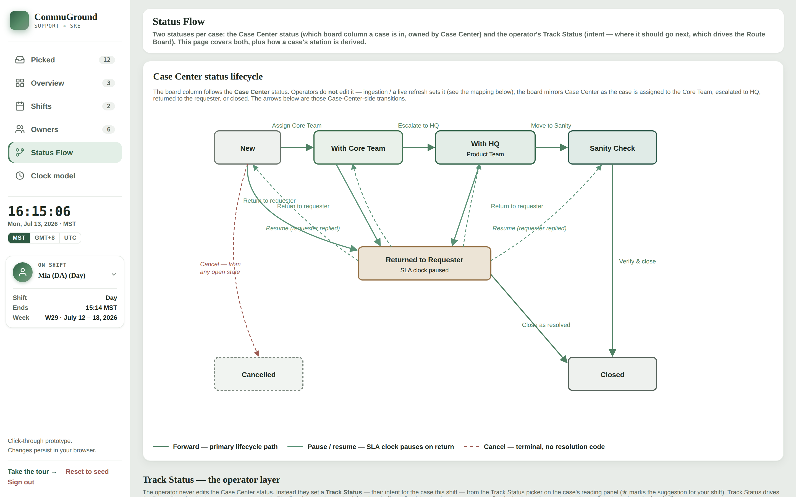

**Instructor checkpoint:** ask the trainee — *"A case's pill says In-Progress but its Track Status
says Escalate to Core Team. Who set each value, and which one will Case Center ever see?"*
(Answer: sync set the pill, the operator set the intent; Case Center sees neither — the intent
stays internal.)

---

## Module 4 — Triage and picking

Cases flow into the board automatically. **Picking** is how you say *"I am following this one up"* —
it lifts a case out of the general pool into your Picked workspace and onto the Route Board.

```
   OVERVIEW (all cases, by week)                 PICKED WORKSPACE (your cases)
  ┌────────────────────────────┐     + Pick     ┌───────────────────────────┐
  │ C-2402  Weekend outage …   │ ─────────────▶ │ ● C-2402 on the Route     │
  │ C-2413  New starter …      │                │   Board + in your list    │
  │ C-2425  Guest WiFi …       │   ✓ Picked =   │                           │
  │ C-2401  APAC users … ✓     │   someone      │  (✓ Unpick puts it back)  │
  └────────────────────────────┘   already has it└───────────────────────────┘
```

Open **Overview**, click into the current week, scan the table, and press **+ Pick** on anything
you'll handle. Cases someone already picked show a green **✓ Picked** badge.

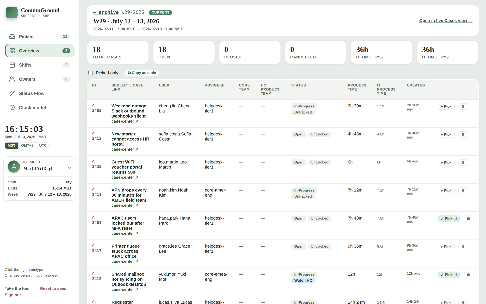

Rules of picking:

- **Closed cases can't be picked.** If the Case Center status is Close/Drop, the + Pick button
  isn't offered — the case is finished.
- **Picking is attribution.** The case history records *picked by \<you\>*, and your name appears
  as the tracker tag on its Route Board row.
- **A case that closes while picked** drops out of the active workspace by itself.
- **Case not on the board at all?** — use **+ Import case by ID** at the top of the Picked page:
  type the Case Center ID. The case is loaded **from the team database first** (instant); if it
  isn't stored yet, the board asks the backend to **ingest it from Case Center on the spot** —
  the loading overlay tells you this can take a moment. Either way it lands added and auto-picked
  under your name.

**Try it:** in Overview, open the current week, pick any open case, then go to **Picked** — your
case is now on the Route Board and in the list, tagged with your name.

---

## Module 5 — Reading the Route Board

The Route Board is the heart of the tool — one horizontal lane per picked case, laid across three
stations. Learn to read one row and you can read them all:

```
            USER            1ST LINE          CORE TEAM              HQ
             ┆                (mid-lane)          ┆                   ┆
 ┌────────┐  ┆                                    ┆                   ┆
 │ 👤 Mia │  ◉━━━━━━━━━━━●━━━━━━━━━━━━━━━━━━━━━━━━┆━━━━━━━▶◯ [overdue 17:30]
 └────────┘  ┆  C-2407 · 53h                      ┆                   ┆
   tracker   solid dot     travelling dot      target ring        deadline chip
   tag       = holding     = case is moving    = hand over        red = overdue
   (who      it now        along the arrow       to here
   picked/
   handed)   ┆                                    ┆                   ┆
 ┌────────┐  ┆                                    ●╌╌╌👁 C-2412 · 12h ┆
 └────────┘  ┆                              watch mode: eye + dashed ╌╌▶
             ┆                              ring — “keep an eye on it”
             ┆                                    ┆                   ┆
             ◉  ─  Sanity Check · 3 cases  (− click to collapse the group)
```

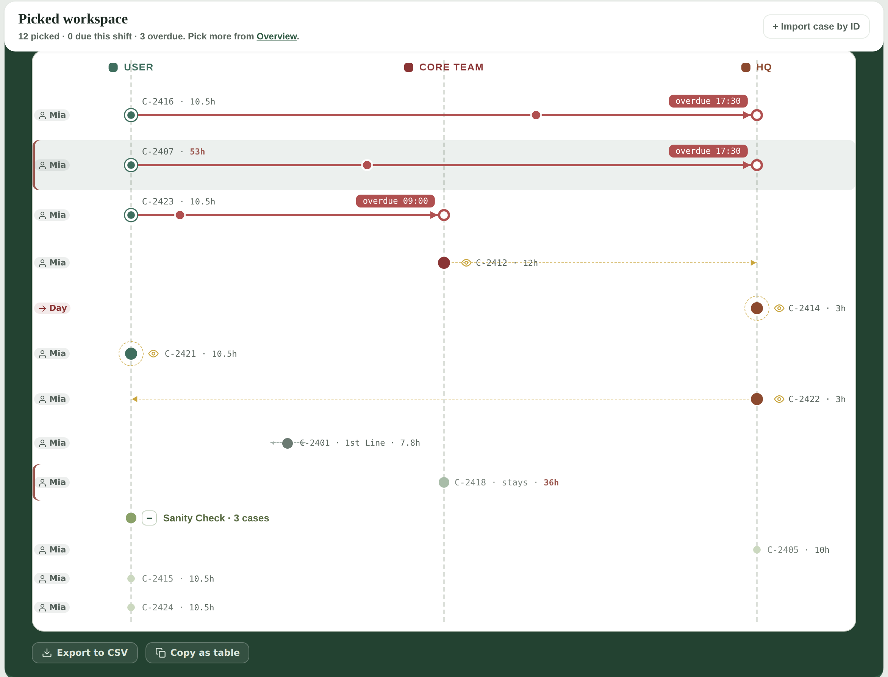

Decoding, element by element:

| You see | It means |
| --- | --- |
| **Solid dot** at a station | The case is parked there right now (that party holds it) |
| **Travelling dot on a solid arrow** | A scheduled hand-off is in motion toward the arrow's target |
| **Hollow ring** at the arrow's end | The station the case must reach |
| **Deadline chip** (`overdue 17:30`) near the arrow's end | When the hand-off is due — **red means overdue, act now** |
| **Eye + dashed ring/arrow** | Watch mode: no deadline, but you're keeping an eye on it |
| **👤 name tag** (left edge) | Who picked the case; an **→ arrow tag** means it was handed to that person/shift |
| **Blue+pink diamonds** right of the name | The case is on the **TKMS page** (the "Added to TKMS page" checkbox, [Module 7](#module-7--handover)) |
| **`stays`** label | The case intentionally stays at its station |
| **Sanity Check · N cases** | Collapsible group of sanity-check cases — click the header to fold/unfold. These cases also live on their own **Sanity Check tab** in the picked list, so they don't crowd out active work |
| Green title-bar counters | `3 moving · 3 overdue · 4 watch` — the board's live summary |
| **Mine only** checkbox | Hide everyone else's rows |

The dot's *position* always comes from Case Center's data (who really holds the case); the *arrow
and deadline* come from your Track Status. That's the two-status model drawn as a picture.

**Try it:** find the most urgent row on the board (a red chip = overdue hand-off), click the row,
and read in the panel below what the case is waiting for.

---

## Module 6 — Track Status in depth

Set the Track Status from the reading panel's toolbar (the dropdown on the left). Use this
decision tree:

```
                        ┌──────────────────────────────┐
                        │  What should happen next?    │
                        └──────────────┬───────────────┘
       ┌───────────────┬───────────────┼────────────────┬──────────────────┐
       ▼               ▼               ▼                ▼                  ▼
  needs CORE      needs HQ        HQ has it —      waiting on the     it's done /
  TEAM work       work            just watching    USER               verifying
       │               │               │                │                  │
       ▼               ▼               ▼                ▼                  ▼
 ┌───────────┐  ┌──────────────┐ ┌─────────────┐ ┌───────────────┐ ┌──────────────┐
 │ Escalate  │  │ Weekend Case │ │ Escalated   │ │ Need to       │ │ Case Closed  │
 │ to Core   │  │ (Fri/Sat) or │ │ to HQ —     │ │ contact user  │ │ or           │
 │ Team      │  │ HQ did not   │ │ keep an eye │ │               │ │ Sanity Check │
 └───────────┘  │ handle       │ └──────┬──────┘ └───────────────┘ └──────────────┘
   arrow ▶Core  └──────────────┘        │ already past 24h and
   due 09:00      arrow ▶ HQ            │ HQ owns it for good?
                  due 17:30             ▼
                                 ┌──────────────┐
                                 │ Product Team │  parked at HQ permanently;
                                 │ Handling     │  the red over-limit time
                                 └──────────────┘  flag switches OFF
```

The full list — the first three schedule an animated hand-off with a deadline chip:

| Track Status | Board effect | Default deadline |
| --- | --- | --- |
| **Weekend Case** | Arrow → HQ | Sunday 17:30 MST |
| **HQ did not handle** | Arrow → HQ | Next Day shift, 17:30 MST |
| **Escalate to Core Team** | Arrow → Core Team | Next Day shift, 09:00 MST |
| **Escalated to HQ — keep an eye** | 👁 watch at HQ | — |
| **Product Team Handling** | 👁 watch at HQ **permanently** — for cases already past the 24 h IT-time limit that HQ owns now; the red over-limit flag switches off (hours still display and count) | — |
| **Need to contact user** | 👁 watch at User | — |
| **Case Closed** | Removed from active workspace | — |
| **Sanity Check** | Folded into the Sanity Check group | — |

Notes: your shift's *suggested* statuses are marked in the picker, but all eight are always one
click away. When you set a scheduled status you can override its hand-off time. **Clear** removes
the intent.

### Assigning a Core Team member

When a case is escalating to the Core Team, record **who** on that team is taking it: click the
case's **deadline chip on the Route Board** (or the *Assign* button in the panel's Routing box).
Desk first, then the **member — mandatory**:

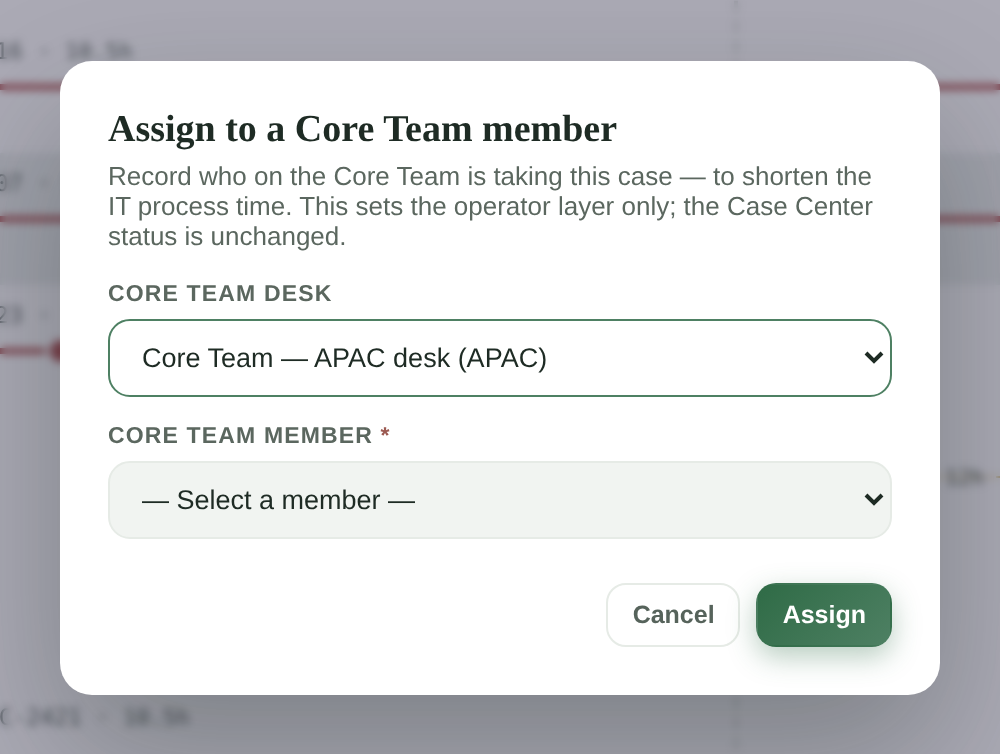

After assigning, the chip shows the member's name, and exports print it in the *Core Team* column.
As the modal says: this sets the operator layer only — the Case Center status is unchanged.

**Try it:** set *Escalate to Core Team* on one of your picked cases, watch the arrow appear, then
click its deadline chip and assign a desk + member. The chip becomes the member's name.

---

## Module 7 — Handover

A shift ends; the cases don't. The handover rule: **every open picked case carries a fresh note
for the next shift.**

```
    DAY SHIFT                                   NIGHT SHIFT
  ┌──────────────┐                            ┌──────────────┐
  │ Mia works    │   1) Shifts page shows     │ Ren reads    │
  │ C-2407       │      which cases still     │ the note on  │
  │              │      miss a fresh note     │ C-2407 and   │
  │              │   2) Write handover note   │ continues —  │
  │              │      (or “Hand over to…”   │ no cold      │
  │              │      a named teammate)     │ start        │
  └──────┬───────┘                            └──────▲───────┘
         │      note = state · next step · watch-outs      │
         └─────────────────────────────────────────────────┘
              every note is kept forever in History
```

- The **Shifts** page shows each shift's handover state — which picked cases still lack a fresh
  note for the current shift.
- **Write handover note** (reading-panel toolbar) = general end-of-shift note.
- **Hand over to…** = the same, but addressed to a **named teammate**. Their name then appears as
  the row's tracker tag (→ name) and in the export's *Handover Route* column
  (`you → them`).
- A good note answers three questions: *what's the state? what's the next step? what should they
  watch out for?*
- Notes are **never lost**: the case's **Handover notes** panel shows the full note history — the
  latest one highlighted, every earlier note listed beneath it — and each is also in the History
  log with author and time.
- **You can delete your own notes** — a ✕ appears on notes you wrote (confirmation asked; the
  deletion itself is recorded in History). You can't delete anyone else's.
- **"Added to TKMS page"** — a checkbox in the case toolbar. Tick it once the case has been added
  to the TKMS page; the export's *If added to TKMS page* column then shows `Yes`
  ([Module 8](#module-8--exports)).

**Try it:** press **Write handover note** on a picked case and save one sentence. Find it in the
History section, then check the Shifts page — that case no longer counts as missing a note.

---

## Module 8 — Exports

Two buttons at the bottom of the Route Board's green frame:

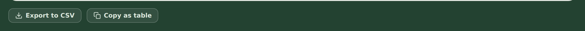

| Button | What you get | Use it for |
| --- | --- | --- |
| **Copy as table** | A real table on the clipboard | Paste directly into **MS Teams**, Outlook, Excel — it arrives as a formatted table, not a wall of text |
| **Export to CSV** | A `.csv` download | Archiving, further analysis |

Both export the rows the board is currently showing (so **Mine only** filters the export too), in
these columns:

| Column | Content |
| --- | --- |
| Case Link | Clickable Case Center URL |
| Subject | Case title |
| IT Process Time | Time actively on IT (the *SLA · time on us* clock) |
| Track Status | Your current intent |
| Handover Route | Latest handover as `operator A → operator B` |
| Core Team | The **assigned member's name** ([Module 6](#module-6--track-status-in-depth)) |
| If added to TKMS page | `Yes` when the case's **"Added to TKMS page"** checkbox is ticked ([Module 7](#module-7--handover)) |
| HQ Product Team | Assigned HQ team |
| Note | **Every handover note** on the case (and only handover notes — no picks/status actions; the admin's notes are excluded), all in **one cell** on separate lines: `MM/DD OperatorName: text` |

The **Overview** week table has its own *Copy as table* button, with a *Picked only* filter beside
it.

**Try it:** press **Copy as table**, paste into a Teams chat (or Excel) and confirm it renders as
a table with the nine columns above.

---

## Module 9 — Data freshness and clocks

### When does the board update?

```
  automatic:   Case Center ──▶ DB      every N minutes (scheduled ingest)
  manual  :    ⟳ on a case            re-ingests THAT case right now
               + Import case by ID     DB read first; ingests from Case Center only if missing
```

Use the **⟳** button (case toolbar / card) when you know something just changed in Case Center —
status, assignee, or the process timeline — and you don't want to wait for the schedule.

### What can a refresh change? (field ownership)

```
 ┌── CASE CENTER OWNS (refresh updates) ──┐   ┌── YOU OWN (refresh never touches) ──┐
 │ status · subject · priority · link     │   │ picked / unpicked  · Track Status   │
 │ user · assignee & departments          │   │ handover notes     · reminders      │
 │ process timeline · wait-user info      │   │ Core member assign · history        │
 └─────────────────────────────────────────┘   └─────────────────────────────────────┘
```

This split is why you can refresh fearlessly — sync and operators write to different halves of the
case.

### The three clocks

Open any case; the top of the reading panel shows:

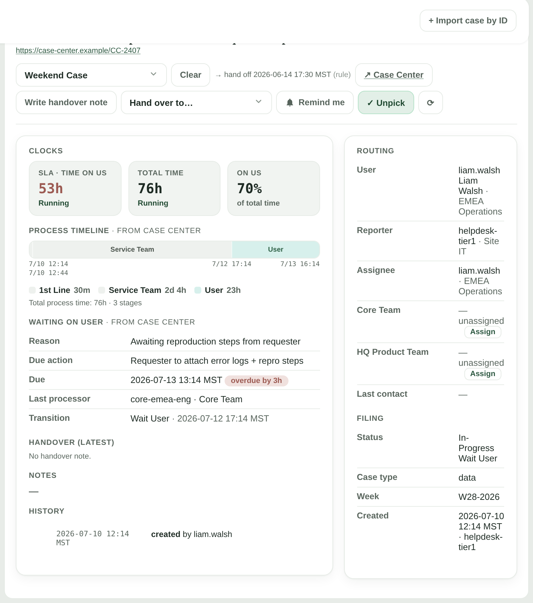

```
 case lifetime ────────────────────────────────────────────────▶
 ├── 1st Line ──┤├──── Service Team (Core) ────┤├── waiting on User ──┤
 ◀────────────── IT PROCESS TIME (“time on us”) ─────────▶
 ◀──────────────────────── TOTAL TIME ─────────────────────────────▶
                        ON US = IT process time ÷ total time (%)
```

| Clock | Meaning |
| --- | --- |
| **SLA · time on us** | Time the case was actively on IT (1st Line + Core/Service stages). This is the *IT Process Time* export column — the number we're measured on. |
| **Total time** | The whole elapsed lifetime, including waiting on the user. |
| **On us** | The IT share of total time, as a percentage. |

The **Process timeline** bar under the clocks is Case Center's own stage log — who held the case,
when, for how long. The **Clock model** page in the sidebar has the precise definitions.

All displayed times follow the sidebar's **timezone toggle**; everything you do is recorded at the
real current time (the one the sidebar clock shows).

---

## Module 10 — Shifts and Owners

Two supporting pages — usually a lead maintains them, but everyone should be able to read them.

**Shifts** — both shifts side by side: rosters, hours, and per-shift handover state; click a shift
for its detail and the weekly rota. **Save** writes to the shared database, so the roster is the
same for everyone (it's also the list behind the sign-in "Who are you?" picker).

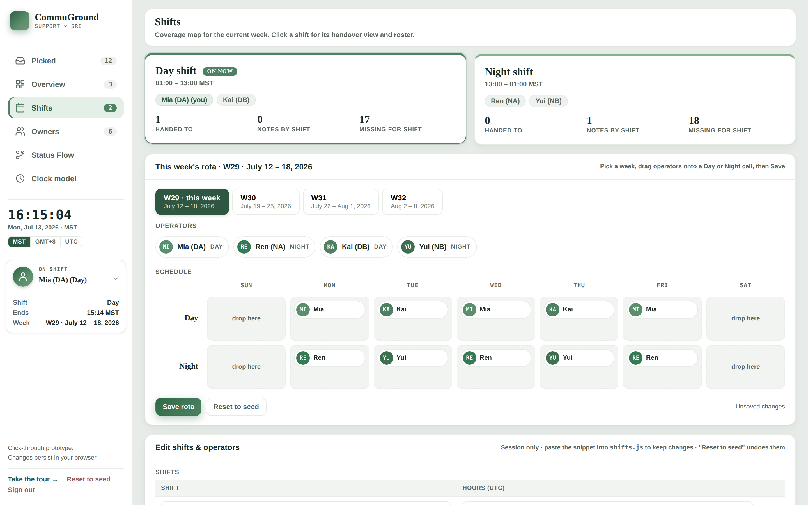

**Owners** — the routing directory: Core Team desks (with their members — the names offered in the
assign modal) and HQ Product Teams, plus the Case-Center department lists that decide which station
an assignee belongs to. Also saved to the shared database.

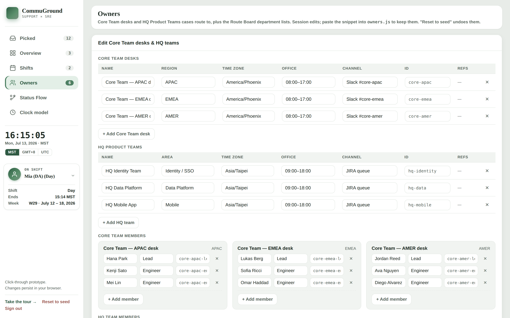

---

## Module 11 — Troubleshooting

| You see | What it means / what to do |
| --- | --- |
| *"That token was rejected."* at sign-in | Wrong or rotated access token — get the current one from your lead |
| The sign-in screen appears mid-session | The token was rotated; sign in again — nothing is lost |
| Empty board + *"Could not reach the case API"* | Backend down/unreachable — refresh later, tell your admin |
| No **+ Pick** on a case | The case is Closed/Dropped — finished cases can't be picked |
| *"C-… is Closed — cannot be picked."* toast | Same as above (you clicked a stale button) |
| ⟳ shows *"Server-side ingest failed (HTTP 502)"* | The API host is missing Case Center credentials — an admin fix (see [`SETUP.md`](SETUP.md)); scheduled sync may still work |
| *"Case … not found — not in the database, and Case Center returned nothing"* on import | Check the ID spelling; the case may be outside your access |
| Import takes a while with *"retrieving it from Case Center…"* | Normal — the case wasn't stored yet, so the backend is fetching it from Case Center right now |
| Wrong name on your actions | You're signed in as someone else — fix it in the sidebar **ON SHIFT** dropdown |
| Times look shifted | Check the sidebar timezone toggle (MST / GMT+8 / UTC) |

---

## Appendix — Sign-off checklist

Trainee can, unaided:

- [ ] 1. Sign in with the team token and select **their own** operator name
- [ ] 2. Explain the difference between the Case Center status and the Track Status
- [ ] 3. Find and pick an unhandled case from the current week in Overview
- [ ] 4. Import a case by its Case Center ID
- [ ] 5. Read a Route Board row: who holds the case, where it's going, when it's due, whether it's overdue
- [ ] 6. Set *Escalate to Core Team* and assign a Core desk **and member** via the deadline chip
- [ ] 7. Put a case into watch mode and find it again (eye icon)
- [ ] 8. Write an end-of-shift handover note and one addressed to a teammate
- [ ] 9. Export the board with **Copy as table** and paste it into Teams as a table
- [ ] 10. Use ⟳ to refresh one case and explain what a refresh can and cannot overwrite

---

*Deeper reference: the in-app **Status Flow** and **Clock model** pages ·
[`README.md`](../README.md) (feature tour) · [`SETUP.md`](SETUP.md) (setup & credentials).*
